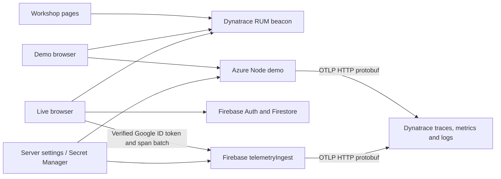

# ChaiCart observability — all three sites

Deployment snapshot: 5 October 2026. This runbook covers the workshop website, Azure demo and Firebase student app. Credentials are deliberately excluded. The complete runbook is maintained in `observability.md` at the root of both repositories.

## Contents

- [Sites and architecture](#sites-and-architecture)
- [Coverage](#coverage)
- [RUM configuration](#rum-configuration)
- [Configuration](#configuration)
- [Deployment and maintenance](#deployment-and-maintenance)
- [Correlation and identity](#correlation-and-identity)
- [Metrics](#metrics)
- [Workshop demonstration](#workshop-demonstration)
- [Investigation queries](#investigation-queries)
- [Verification and troubleshooting](#verification-and-troubleshooting)
- [Rehearsal and acceptance checklist](#rehearsal-and-acceptance-checklist)
- [Implementation map](#implementation-map)
- [References](#references)

## Sites and architecture

| Site | Public URL | Hosting / backend | OTel service names |
|---|---|---|---|
| Workshop and facilitator materials | https://theharithsa.github.io/chaicart-cloud-workshop/ | GitHub Pages, static HTML | None; RUM only |
| ChaiCart Demo | https://chaicart-workshop-vh-20261003.azurewebsites.net/ | Azure Linux App Service, Node.js | `chaicart-demo` |
| ChaiCart Live | https://chaicloud-workshop.web.app/ | Firebase Hosting, Auth, Firestore; Node.js 22 telemetry Function | `chaicart-live-browser`, `chaicart-live-telemetry` |



RUM goes directly to its configured beacon. OTLP credentials are held by the backends, never by browsers. Live's `/api/telemetry` is a same-origin Hosting rewrite to `telemetryIngest` in `asia-south1`; its direct Cloud Run URL is not needed in frontend configuration. Student operations continue to use the Firebase SDK directly.

## Coverage

| Application | Frontend | Application telemetry |
|---|---|---|
| Azure ChaiCart Demo | Dynatrace RUM tag `9d2e601e85292693`; customer and facilitator pages | Node OTel SDK: HTTP, auth, cart, payment pool, simulated gateway/database stages, persistence/fulfillment, logs and runtime/application metrics |
| GitHub Pages workshop | Dynatrace RUM tag `c7e71b371e8cb3b1` on every HTML entrypoint | Static pages have no application backend to instrument |
| Firebase ChaiCart Live | The same RUM tag as the workshop Pages; hash-route navigation and Google user tagging | Browser OTel spans around Firebase SDK operations; protected gateway forwards spans and produces correlated OTel logs/metrics |

The demo is one Node process. Named payment/database/business-system stages are logical components, not separate deployed microservices. The pool is a real in-process concurrency limiter, while database/gateway timings are explicitly simulated. OTel runtime metrics are process metrics, not App Service VM/host monitoring. Problems/alerts require tenant configuration; a scenario does not automatically create a Dynatrace Problem.

Live's reports are marked `telemetry.source=client-observed`. They measure browser-visible SDK latency/outcome, including cache/network effects; they do not trace inside Google's Firestore service. Scores and audit evidence still come from Firestore and the credit ledger. Browser reports can be missing during disconnections or tab closure.

## RUM configuration

Install the tag in the document head before application modules. Demo customer and facilitator pages use:

```html
<script type="text/javascript" src="https://js-cdn.dynatrace.com/jstag/18b1df4492a/bf12470wrz/9d2e601e85292693_complete.js" crossorigin="anonymous"></script>
```

Workshop Pages and ChaiCart Live share this tag:

```html
<script type="text/javascript" src="https://js-cdn.dynatrace.com/jstag/18b1df4492a/bf12470wrz/c7e71b371e8cb3b1_complete.js" crossorigin="anonymous"></script>
```

The JavaScript API is `dtrum.identifyUser(identity)` with a capital `U`. Identity helpers retry briefly if the agent is not ready; RUM failures never prevent sign-in or app use. Live also reports sanitized operation error codes through the optional RUM error API. RUM behavior such as session capture, route detection, retention and frontend/backend linking depends on tenant settings; verify hash-route navigation during rehearsal.

The Pages workflow must include `rum-identity.js` in its published artifact. Demo serves its module at `/rum-identity.js`; Live bundles `src/lib/rum-identity.ts`. A loaded HTML page alone does not prove the identity module or RUM beacon succeeded.

## Configuration

Server-only variables:

```text
OTEL_EXPORTER_OTLP_ENDPOINT=https://indiacs.live.dynatrace.com/api/v2/otlp
DYNATRACE_PLATFORM_TOKEN=<server-side secret>
DEPLOYMENT_ENVIRONMENT=workshop
SERVICE_VERSION=1.1.0
OTEL_METRIC_EXPORT_INTERVAL=15000
```

Export is OTLP/HTTP **protobuf** with gzip. The SDK appends `/v1/traces`, `/v1/metrics` and `/v1/logs` to the base URL. Classic `dt0c01` tokens use `Authorization: Api-Token …`; platform tokens use `Authorization: Bearer …`. Production uses a classic token. The legacy `DYNATRACE_PLATFORM_TOKEN` setting and Function secret accept either token type. Classic token scopes are `openTelemetryTrace.ingest`, `metrics.ingest`, and `logs.ingest`. For platform tokens, token scopes and the owning user's permissions must both include:

- `openpipeline:traces:ingest`
- `openpipeline:metrics:ingest`
- `openpipeline:logs:ingest`

Dynatrace's direct endpoint requires HTTP binary protobuf; direct gRPC and JSON payloads are unsupported.

The `.apps` address is the Dynatrace UI, not the OTLP base URL. Store the token in encrypted App Service configuration or a Firebase Function secret. Never add it to frontend variables, HTML, source control, ZIP files, screenshots, or exported workshop evidence. Unset the demo endpoint to disable server export. The Function endpoint is configured in `functions/index.js`; disabling browser forwarding requires a new Live build without `VITE_TELEMETRY_ENABLED=true`. For a local collector, use `http://127.0.0.1:4318` and omit the token.

The supplied RUM tags use beacon `https://bf12470wrz.bf.dynatrace.com/bf`. The demo CSP permits this and the Dynatrace script CDN. The demo extracts W3C `traceparent` and `tracestate` when supplied. Same-origin API calls are the default; automatic RUM-to-backend linking additionally requires compatible tenant correlation settings. Live explicit browser spans use their own trace context; the gateway preserves their IDs and links its request span to them. Do not assume these imported spans are automatically children of a RUM action. For a cross-origin gateway, configure **only its URL** in Dynatrace's advanced correlation settings and allow the trace headers on that gateway. Do not enable propagation to arbitrary Google endpoints.

## Deployment and maintenance

### Azure demo

Resources: App Service `chaicart-workshop-vh-20261003`, resource group `rg-chaicart-workshop`, subscription D1/APAC, Central India. Authentication remains Firebase Google sign-in; facilitator access is checked against Firestore admins. The observability token is separate from Firebase authentication credentials.

Keep the OTLP base URL and token in protected App Service settings. `telemetry.js` accepts `DYNATRACE_TOKEN` or the legacy `DYNATRACE_PLATFORM_TOKEN` setting; an explicit code option takes precedence, followed by `DYNATRACE_TOKEN`. Classic `dt0c01` values select `Api-Token`; other configured values select `Bearer`. Avoid leaving an old preferred setting when rotating the legacy setting.

From the workshop repository:

```sh
cd chaicart-demo
npm ci
npm test
npm ci --omit=dev
zip -r /tmp/chaicart-demo.zip package.json package-lock.json server.js auth.js telemetry.js public node_modules
az webapp deploy --resource-group rg-chaicart-workshop \
  --name chaicart-workshop-vh-20261003 \
  --src-path /tmp/chaicart-demo.zip --type zip
```

Build the deployment package on a runtime-compatible environment. Include no `.env`, service-account files, local order data or ingestion credentials. See the demo deployment runbook for persistent data and recovery details. A successful upload is not startup confirmation: check `/health`, the new static modules and runtime diagnostics. Restart if the running process still serves the previous release.

### Firebase Live

Project: `chaicloud-workshop`. Blaze is enabled and the telemetry gateway is deployed. From the Live repository, with its existing public Firebase web configuration available:

```sh
npm ci
npx --yes npm@10 ci --prefix functions
npm test --prefix functions
npm run lint
VITE_TELEMETRY_ENABLED=true npm run build
npx firebase-tools deploy --project chaicloud-workshop --only functions:telemetry,hosting
```

For browser-only changes, use `--only hosting`. Preserve `VITE_TELEMETRY_ENABLED=true` on production builds; omitting it disables browser forwarding while leaving RUM active. The Function lockfile is checked with npm 10 to match the Node.js 22 cloud builder.

Create or rotate the protected token interactively:

```sh
npx firebase-tools functions:secrets:set DYNATRACE_PLATFORM_TOKEN --project chaicloud-workshop
npx firebase-tools deploy --project chaicloud-workshop --only functions:telemetry
```

The legacy secret name holds the production classic token. A new secret version requires Function redeployment. The Function runtime has Secret Manager access to this secret. Never put the ingestion token in `VITE_*`, Firestore documents or the Hosting build.

Gateway controls:

- POST JSON only; maximum request body 64 KiB and 24 spans per batch.
- Verified, non-revoked Google Firebase ID token with verified email.
- Allowlisted Firebase Hosting origins; origin checking supplements authentication.
- Allowlisted operation names and attributes, valid IDs and bounded timestamps/durations; client-supplied identity is replaced with verified identity.
- Rate limit of 120 requests per minute per UID **per Function instance**, with at most 2,000 tracked keys. This is not a globally coordinated quota.
- Maximum two instances, concurrency 40, 30-second timeout and 256 MiB memory. Failed telemetry delivery does not roll back successful Firestore operations.

The browser queue is bounded to 256 spans and batches of 24, with an eight-second gateway request timeout. The gateway flushes before its invocation completes. Node exporters have bounded queues, batches and timeouts, delta metrics and explicit histogram buckets. These controls reduce load; they do not guarantee delivery during outages.

Optional RUM-only fallback:

```sh
npm run build
npx firebase-tools deploy --project chaicloud-workshop --only hosting --config firebase.rum-only.json
```

This removes the Hosting telemetry rewrite and disables browser forwarding in the rebuilt app. It does not delete the Function or its secret. Existing scoring rules do not need changing for observability.

### GitHub Pages

Push the workshop repository to `main`; `.github/workflows/pages.yml` publishes the HTML, assets and `rum-identity.js`. There is no Node or Firebase backend for these static pages. Link Markdown runbooks through GitHub rather than assuming raw `.md` files are rendered or copied by the Pages workflow.

For rollback, redeploy a reviewed previous source/build and its matching settings. Firebase Hosting supports rollback to a retained previous release; Function rollback requires redeploying its source and intended secret version. Azure rollback must preserve the app's data directory. Do not rotate Firebase auth credentials as a workaround for a Dynatrace ingestion failure.

## Correlation and identity

On restored or new Google sessions, call `dtrum.identifyUser(user.email)`. Signed-out visitors use `browser:<random UUID>`, stored under `chaicart-rum-browser-id` in local storage. Sign-out restores this browser ID rather than passing an empty value. Static workshop pages always use the browser ID. Each origin has its own ID; it is not a hardware fingerprint or a cross-site identifier. Clearing storage resets it. If storage is unavailable, it lasts for the page lifetime. The browser ID is only a RUM tag and never grants access or replaces verified backend identity. Signed-in UID and email are attached to backend spans/logs after token verification. Emails are captured with workshop participant consent; credentials and form contents are not captured.

- `trace.id` / `span.id`: OTel context automatically associates logs with active spans. Local evidence uses `trace_id` / `span_id`.
- `request.id`: one HTTP attempt, also returned in `x-request-id`.
- `transaction.id`: one business operation, returned in `x-transaction-id`.
- `order.id`: links checkout to later tracking requests. Each tracking request has a new trace, while retaining the checkout transaction ID.
- `user.id`, `user.email`: verified Firebase identity; never metric dimensions.
- `workshop.session.id`, `workshop.activity.id`: Live context where available.
- `service.name`, `service.version`, `deployment.environment.name`: deployment identity.

Live generates real browser OTel spans and preserves their IDs when forwarding. Transaction reads are child spans of the same transaction; retries stay within the transaction operation. Gateway logs use the imported browser span's trace context and identity derived from the verified token. Gateway HTTP traces also link to the imported operation traces. Reports are allowlisted, size/time bounded, and rate limited. Switched accounts cannot inherit another account's queued telemetry.

## Metrics

| Metric | Unit / meaning |
|---|---|
| `chaicart.http.requests` | Request counter by normalized route, method, status |
| `http.server.request.duration` | Explicit-bucket latency histogram, seconds |
| `http.server.active_requests` | Requests in progress |
| `chaicart.checkout.outcomes` | Success/failure; `sli.good` means successful and under two seconds |
| `chaicart.operation.outcomes` | Pool acquisition and reported Live operation outcomes |
| `chaicart.operation.duration` | Operation latency histogram, seconds |
| `chaicart.payment.pool.capacity`, `.active`, `.waiting` | Pool limit, acquired slots, queued requests |
| `chaicart.fulfillment.backlog`, `chaicart.fulfillment.backlog.age` | Pending ERP events and oldest pending age in seconds |
| `process.memory.usage`, `nodejs.memory.heap.used` | RSS and used heap, bytes |
| `process.cpu.utilization`, `nodejs.eventloop.delay`, `process.uptime` | Process CPU ratio, loop delay in seconds, uptime |
| `chaicart.telemetry.export.failures`, `.partial_success` | Cumulative exporter health gauges |
| `chaicart.telemetry.dropped_batches` | Queue/drop diagnostic count |

Counters/histograms use delta temporality. IDs/emails are log/span fields, not metric dimensions. INFO dashboard polling logs are suppressed by the OTel request instrumentation. Browser snapshot listeners produce finite initial-load/error/recovery records instead of one infinite span or a log for each update. Queues are bounded; export failures do not block business requests.

## Workshop demonstration

1. Sign in with Google and place an order in healthy mode. Open its trace ID from the receipt. Find the same email in RUM. Follow checkout → pool acquisition → simulated gateway → persistence/fulfillment and inspect correlated logs.
2. Enable **pool exhaustion** and start the facilitator's bounded surge. Compare pool waiting, operation latency, checkout p95 and failures. Inspect a timeout trace: the failed request never reaches the gateway.
3. Roll back to healthy. Confirm waiting drains, checkout succeeds and failures stop.
4. Enable **gateway down**. Show the gateway span failing and the payment error log on the same trace. Confirm the pool is released after failures.
5. Enable **ERP down**. Orders succeed but backlog/oldest age increase. Restore healthy and show the backlog drains.
6. In Live, sign in, join a team and submit an activity. Find the email, Firestore operation, transaction reads and corresponding operation log. Use a controlled rejected operation to inspect `error.type=permission-denied`; do not change production rules just to manufacture a failure.

Suggested dashboard tiles: checkout traffic/outcomes; checkout latency p95; pool active/waiting/capacity; fulfillment backlog/age; Node memory/event-loop delay; Live operation outcomes/duration; recent error logs; recent traces; exporter health. RUM pages show the client experience separately.

## Investigation queries

These are starter DQL queries; validate them against tenant data and permissions before saving dashboard tiles. The ingestion token does not automatically grant query or dashboard-edit access.

Find a participant's logs:

```dql
fetch logs, from: -30m
| filter startsWith(service.name, "chaicart")
| filter user.email == "participant@example.com"
| fields timestamp, content, loglevel, service.name, trace.id, span.id, transaction.id, order.id
| sort timestamp asc
```

Follow a business transaction across requests:

```dql
fetch spans, from: -30m
| filter transaction.id == "REPLACE_WITH_TRANSACTION_ID"
| fields start_time, span.name, service.name, duration, trace.id, span.id, user.email, order.id
| sort start_time asc
```

Show one trace's logs:

```dql
fetch logs, from: -30m
| filter trace.id == toUid("REPLACE_WITH_32_HEX_TRACE_ID")
| fields timestamp, content, loglevel, span.id, transaction.id, user.email
| sort timestamp asc
```

Discover ingested metrics before building tiles:

```dql
metrics from: -1h
| filter startsWith(metric.key, "chaicart.") or metric.key == "http.server.request.duration"
| fields metric.key
```

Pool pressure:

```dql
timeseries {
  active = max(chaicart.payment.pool.active),
  waiting = max(chaicart.payment.pool.waiting),
  capacity = max(chaicart.payment.pool.capacity)
}, filter: { service.name == "chaicart-demo" }
```

## Verification and troubleshooting

- `npm test` in the demo covers existing checkout/outage behavior and a local collector test that independently decodes OTLP protobuf for all signals, checks delta temporality, and verifies concurrent user isolation and RUM trace-context propagation.
- Live's build/lint and full emulator rule suite cover the existing workshop workflow. Gateway validation tests reject oversized/invalid/spoofed payloads and confirm verified identity overrides client input.
- A **401** is invalid/expired authentication; **403** can be a missing signal scope or owning-user permission. Inspect each signal independently: logs working does not prove traces/metrics work.
- A **404** often indicates the UI address was used as an ingest URL. **400/partial success** indicates a rejected payload; check temporality/schema and exporter health.
- RUM has its own ingestion path/configuration. Script load and `dtrum.identifyUser` availability are necessary checks, but do not by themselves prove a session arrived in Dynatrace.
- Do not claim complete ingestion until all three signals are visible in the tenant and a real Google-session request links from RUM to its backend trace.

## Rehearsal and acceptance checklist

The deployed implementation has passed demo protobuf/correlation regression tests, Live build/lint, gateway validation tests and Firestore rules/scoring tests. A real SDK-generated protobuf export of all three signals was accepted with zero exporter failures after switching to the classic token. Public identity modules and gateway authentication rejection were checked. These checks are distinct from confirming records and RUM links in the tenant.

Before students arrive:

1. Open each public site in a fresh browser. Confirm the RUM script and identity module load, beacon requests succeed, and the anonymous browser tag appears in Dynatrace.
2. Reload to confirm the browser tag persists. Sign in to Demo and Live with Google, confirm the tag becomes the email, then sign out and confirm it returns to the original browser tag.
3. Place a Demo order; collect `x-trace-id`, `x-request-id`, transaction ID and order ID. Confirm the trace, correlated logs and metrics are visible in Dynatrace, and rehearse frontend/backend navigation where configured.
4. In Live, join a team and perform a legitimate activity operation. Confirm `/api/telemetry` returns 202, imported spans retain their trace IDs, and logs contain the verified email and transaction ID. Initial signed-out operations are RUM-only: the gateway deliberately requires Google sign-in.
5. Verify an unauthenticated POST to Live's gateway returns 401, a disallowed origin returns 403, and GET returns 405. A 202 acknowledges exporter acceptance, not proof that a dashboard query can retrieve every record.
6. Rehearse the controlled outages and recovery sequence. Confirm export failures remain zero, or explain any intentionally disabled exporter.
7. Validate dashboard/query permissions, time range, sampling, retention and budget. The ingestion credential does not grant Grail query access.

Remaining limits: no Firestore internal server tracing, VM/host instrumentation, automatic alert/SLO provisioning, exactly-once delivery or guaranteed offline telemetry. RUM capture settings and a real Google-session end-to-end trace link must be verified in the tenant. User emails have workshop consent; avoid adding credentials or form contents to telemetry. Monitoring data incurs tenant/Firebase usage and should have a suitable retention policy.

## Implementation map

Paths are relative to the named repository.

| Repository | File | Responsibility |
|---|---|---|
| `chaicart-cloud-workshop` | `rum-identity.js`, top-level HTML, `.github/workflows/pages.yml` | Pages RUM and anonymous tag; published artifact |
| `chaicart-cloud-workshop` | `chaicart-demo/public/index.html`, `facilitator.html` | Demo RUM tags |
| `chaicart-cloud-workshop` | `chaicart-demo/public/rum-identity.js`, `customer-auth.js`, `facilitator.js` | Browser ID and email transitions |
| `chaicart-cloud-workshop` | `chaicart-demo/telemetry.js`, `server.js` | Node SDK, context propagation, application spans/logs/metrics |
| `chaicart-cloud-workshop` | `chaicart-demo/test/telemetry.test.js` | Protobuf collector and concurrent identity checks |
| `chaicart-live` | `index.html`, `src/lib/rum-identity.ts`, `src/firebase.ts` | RUM and auth identity |
| `chaicart-live` | `src/lib/telemetry.ts`, `src/lib/firestore.ts` | Browser span creation, transaction context and bounded forwarding |
| `chaicart-live` | `functions/index.js`, `validation.js`, `ingest.js`, `telemetry.js` | Protected gateway, span import and server exporters |
| `chaicart-live` | `firebase.json`, `firebase.rum-only.json` | Gateway rewrite and RUM-only fallback |
| `chaicart-live` | `functions/test/validation.test.js`, `.github/workflows/check.yml` | Payload/identity validation and cloud-compatible dependency checks |

When adding a Live Firestore operation, import the instrumented calls from `src/lib/firestore.ts`. Add bounded operation names to gateway validation where necessary. Preserve verification of identity, transaction context and low-cardinality metric dimensions. Keep the two complete runbook copies aligned when changing shared architecture or endpoints.

## References

- [Workshop repository](https://github.com/theharithsa/chaicart-cloud-workshop)
- [Live repository](https://github.com/theharithsa/chaicart-live)
- [Demo deployment and recovery](https://github.com/theharithsa/chaicart-cloud-workshop/blob/main/chaicart-demo/docs/DEPLOYMENT.md)
- [Demo facilitator sequence](https://github.com/theharithsa/chaicart-cloud-workshop/blob/main/chaicart-demo/docs/FACILITATOR.md)
- [Dynatrace OTLP endpoints and authentication](https://docs.dynatrace.com/docs/ingest-from/opentelemetry/otlp-api)
- [Dynatrace token authentication](https://docs.dynatrace.com/docs/dynatrace-api/basics/dynatrace-api-authentication)
- [Frontend/backend linking](https://docs.dynatrace.com/docs/observe/digital-experience/new-rum-experience/web-frontends/additional-configuration/configure-frontend-backend-linking-web)
- [RUM JavaScript API](https://docs.dynatrace.com/javascriptapi/doc/types/dtrum.html)
